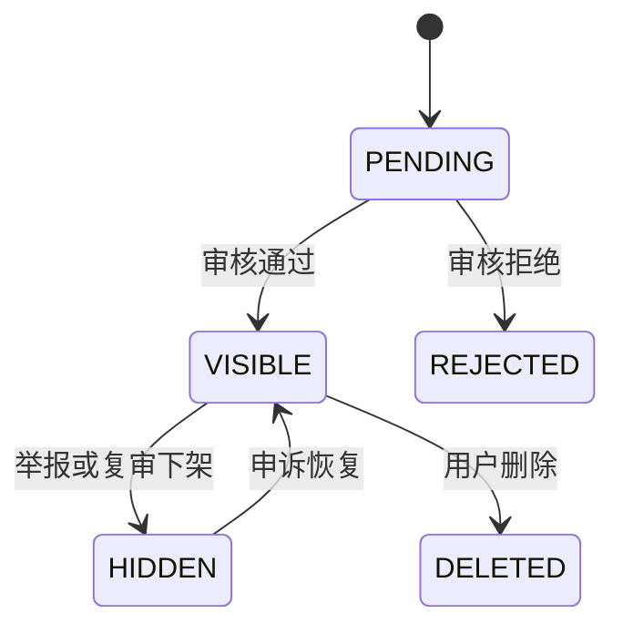
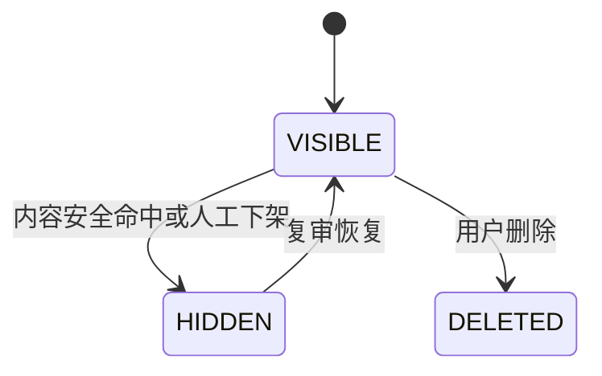
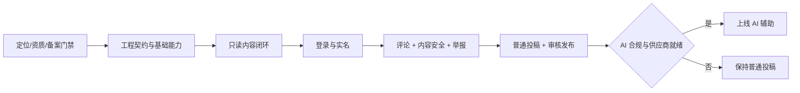

# 知见产品需求文档（补充版）

> 版本：v1.1 补充稿  
> 基线文档：[PRD.md](./PRD.md)  
> 输入依据：[checklist.md](./checklist.md)  
> 适用端：微信小程序、H5  
> 文档目的：补齐一期产品逻辑、状态规则、合规前置和异常闭环，不重复描述基线 PRD 已明确的页面视觉与基础功能。

## 1. 文档效力

本文件是 `PRD.md` 的增量补充。出现冲突时：

1. 已在本文件明确修正的规则，以本文件为准。
2. 合规事项必须由公司法务或持牌顾问最终确认，本文件不替代正式法律意见。
3. 未在本文件修改的内容，继续以 `PRD.md`、`接口与数据模型.md` 和 `design.md` 为准。
4. 第 2 章中的上线门禁未完成前，不得以技术开发完成代替业务上线批准。

## 2. 上线前置门禁

### 2.1 内容定位与资质门禁

产品必须先在以下两条路线中选择一条。

路线 A：保持公共议题、热点及评论产品定位。

- 由法务确认是否构成互联网新闻信息服务或其他需要许可的业务。
- 按最终法律意见准备相应资质、主体、编辑审核队伍和安全评估。
- 资质未完成前，不开放受限制内容及对应评论能力。
- 产品排期必须包含资质办理周期，不能默认与研发并行后即可上线。

路线 B：裁剪一期内容边界。

- 内容范围调整为已获授权转载内容、知识解读或法务确认可开展的非受限领域。
- 首页频道、热点标签、投稿范围和运营选题规范同步修改。
- 建立禁止选题清单和上线前内容复核机制。
- 评论策略仍需满足实名、内容安全和平台规则，是否允许先发后审由法务最终确认。

门禁验收：

- 有书面的业务定位结论。
- 有书面的内容边界和禁发清单。
- 有明确的资质负责人、办理状态和预计完成时间。
- 产品、运营、研发使用同一份结论，不允许各自理解。

### 2.2 部署与备案门禁

- 中国大陆正式业务不得继续默认使用 Netlify 作为唯一生产托管。
- 生产 H5 迁移至具备境内备案和稳定访问条件的云服务。
- 完成域名、ICP备案、小程序备案、企业主体认证和服务器域名白名单配置。
- Netlify 仅保留为开发演示环境，不承载正式用户数据。
- 测试环境和生产环境必须使用不同数据库、对象存储桶及密钥。

### 2.3 AI 服务门禁

- AI 功能上线前，由法务核验模型供应商、算法备案/登记状态及产品自身义务。
- 一期只接入通过公司合规审查的境内服务商。
- 商务合同需要覆盖输入不用于训练、数据保留周期、删除机制、服务地域和安全责任。
- 图片、正文和生成结果发送第三方前，必须在隐私政策中列明并取得必要同意。
- AI 生成结果需要显式提示，并按适用规则保存生成标识或元数据。
- AI 资质或供应商未就绪时，普通投稿能力可以上线，AI 入口必须隐藏，而不是展示不可用按钮。

### 2.4 用户协议与投诉门禁

上线前必须具备：

- 用户协议。
- 隐私政策和小程序隐私保护指引。
- 内容发布规范。
- AI 辅助创作说明。
- 评论社区规范。
- 举报和投诉入口。
- 账号注销入口。
- 客服或投诉处理渠道。

举报和投诉由原 PRD 的 P1 调整为 P0；用户评论和投稿上线时必须同步上线。

## 3. 一期范围修订

### 3.1 P0 新增

- “我的”最小版。
- 我的投稿列表和投稿状态详情。
- H5 手机号验证码登录。
- 小程序手机号授权或其他经法务认可的实名链路。
- 评论内容安全、审核状态和用户删除能力。
- 投稿、评论和图片的内容安全检查。
- 举报入口和投诉处理闭环。
- 账号注销及个人信息删除申请。
- AI 任务恢复、失败重试和配额提示。
- 生产环境境内化、备案和合规材料。
- 受保护的投稿审核能力及审核留痕。

### 3.2 P0 移出或降级

- AI 能力从“一期必须与投稿同时上线”改为独立开关；资质未完成时不阻塞普通投稿闭环。
- 正文一期仅支持段落、小标题、图片和引用。
- 粗体、列表、链接编辑降为 P1，正式版本隐藏对应工具栏按钮。
- 文章朗读、字号设置、消息中心、搜索和个性化推荐继续保持 P1 或 P2。
- 视频明确不在一期范围内。

### 3.3 一期底部导航

正式版一期只展示：

- 首页。
- 投稿。
- 我的。

“专题”和“消息”在对应页面未交付前隐藏。不得保留点击后仅弹出 Toast 的占位入口。

投稿按钮继续使用居中的“+”图标和“投稿”文字。

## 4. 身份、实名与会话逻辑

### 4.1 匿名用户

匿名用户可：

- 浏览首页、频道和内容详情。
- 查看公开推荐和已公开评论。
- 使用分享。

匿名用户不可：

- 点赞、收藏和关注。
- 评论、回复和评论点赞。
- 投稿或使用 AI。
- 举报时提交需要账号追踪的复杂投诉；可保留公开客服渠道。

### 4.2 H5 登录

一期只启用手机号验证码登录，微信 H5 OAuth 保留接口能力但不在产品中展示。

登录流程：

1. 输入手机号。
2. 阅读并勾选用户协议与隐私政策。
3. 获取验证码。
4. 输入验证码并登录。
5. 首次登录自动创建用户资料。
6. 返回触发登录前的页面和操作上下文。

产品规则：

- 未勾选协议时不能发送验证码。
- 验证码按钮显示冷却倒计时。
- 验证码错误、过期或频率超限需要区分提示。
- 不向用户暴露手机号是否已注册。

### 4.3 小程序登录与实名

- `wx.login` 只用于建立微信身份与业务账号的关联。
- 是否满足评论实名要求必须由法务确认。
- 如需手机号实名，用户首次发表评论前触发手机号授权。
- 拒绝授权时仍可继续阅读，但不能发布评论。
- 投稿是否同时要求手机号实名，由内容定位结论决定；默认要求。

### 4.4 新用户默认资料

微信不提供可直接使用的昵称或头像时：

- 默认昵称为“知见读者”加 4 位随机数字，例如“知见读者4821”。
- 默认头像为昵称首字或“知”字的品牌色块头像。
- 随机后缀仅用于展示，不作为稳定用户 ID。
- 用户可在“我的”中修改昵称和头像。
- 昵称和头像更新前必须通过内容安全校验。

### 4.5 登录后继续原操作

需要自动继续：

- 点赞内容。
- 收藏内容。
- 关注作者。
- 点赞评论。

不自动继续：

- 发表评论。
- 回复评论。
- 提交投稿。
- 举报。

评论和回复在登录前保留输入内容及页面滚动位置；登录成功后回到输入态，由用户再次确认提交。

自动继续规则：

- 每次登录只重放一次最近的安全操作。
- 重放前重新确认目标内容仍然存在。
- 页面关闭、操作超过 10 分钟或目标已失效时取消重放。
- 重放失败时提示原因，不无限重试。

### 4.6 `viewer` 状态

- 匿名访问的 `viewer` 整体语义为 `null`，不能返回全 `false`。
- `null` 表示“尚未登录，状态未知”。
- `false` 表示“已登录且当前未点赞/收藏/关注”。
- 公共首页和详情缓存不得包含任何用户的 `viewer` 状态。
- 列表页需要状态时，登录后批量查询；详情页使用独立用户状态查询。

## 5. “我的”最小版

### 5.1 页面范围

一期“我的”必须包含：

- 用户头像和昵称。
- 编辑个人资料。
- 我的投稿。
- 用户协议、隐私政策和内容规范。
- 举报/投诉与联系客服。
- 退出登录。
- 注销账号。

收藏、关注、浏览历史和消息可显示为 P1，但未实现时不展示入口。

### 5.2 我的投稿列表

列表分组：

- 草稿。
- 审核中。
- 已驳回。
- 已通过/待发布。
- 已发布。

每条投稿展示：

- 标题；没有标题时显示“无标题草稿”。
- 封面缩略图；没有封面时不占位。
- 最近更新时间。
- 当前状态及状态说明。
- 驳回原因摘要。

默认按 `updated_at` 倒序，使用游标分页。

### 5.3 投稿可执行操作

`DRAFT`：

- 继续编辑。
- 删除草稿。

`SUBMITTED`：

- 查看提交内容。
- 查看审核进度。
- 一期允许在审核开始前主动撤回；审核已经开始时返回“当前无法撤回”。

`REJECTED`：

- 查看完整驳回原因。
- 基于原投稿创建可编辑修订版。
- 再次提交后保留上一轮审核记录。

`APPROVED`：

- 只读查看。
- 不允许撤回或编辑。

`PUBLISHED`：

- 打开正式内容。
- 分享正式内容。

### 5.4 草稿删除

- 删除前二次确认。
- 只允许删除本人 `DRAFT` 状态投稿。
- 删除采用软删除，避免误删后无法排查。
- 与草稿关联且未被其他内容使用的图片进入延迟回收队列，不立即物理删除。

## 6. 草稿自动保存与冲突处理

### 6.1 首次创建

- 用户进入投稿页时不立即创建空草稿。
- 任一可编辑字段发生有效变化或图片开始上传后，在本地生成临时草稿。
- 停止输入 5 秒后首次创建服务端草稿。
- 用户主动点击“保存草稿”时立即创建，不等待自动保存。
- 完全空白且无媒体的临时草稿退出后不进入“我的投稿”。

### 6.2 自动保存

- 用户停止输入 5 秒后触发保存。
- 连续编辑时至少每 30 秒保存一次。
- 同一时刻只允许一个保存请求。
- 保存过程中发生的新修改进入下一次保存，不被旧响应覆盖。
- 页面退到后台或准备退出时触发一次立即保存。
- 前端本地保留最近一次可恢复快照。

### 6.3 保存状态

页面显示：

- 正在保存。
- 已保存于 HH:mm。
- 保存失败，点击重试。
- 本地已保存，等待网络恢复。
- 内容已在其他设备修改。

保存失败不得清空用户输入，也不得阻止继续编辑和本地备份。

### 6.4 多端冲突

- 每次更新携带 `version` 或服务端返回的版本标识。
- 版本不一致时服务端返回 `409 CONFLICT`。
- 前端停止自动保存并展示冲突处理。
- 用户可选择查看云端版本、保留当前版本副本或覆盖云端。
- 默认不得静默覆盖任何一方。

## 7. 投稿字段与发布映射

### 7.1 频道统一

首页和投稿使用同一份频道数据。

频道具有两个独立能力：

- 是否在首页频道导航显示。
- 是否允许用户投稿。

规则：

- “推荐”是聚合频道，不允许作为投稿栏目。
- “热点”是否允许投稿由运营策略决定，默认关闭。
- 投稿页只展示处于启用状态且允许投稿的频道。
- 频道下线后，历史内容继续保留原频道名称；新投稿不能再选择。

### 7.2 一期正文能力

一期正式支持：

- `paragraph`：段落。
- `heading`：二级小标题。
- `image`：正文图片及替代文字。
- `quote`：引用和来源。

粗体、列表和链接暂不进入正式契约，前端工具栏隐藏。

### 7.3 投稿转正式内容

发布时补齐：

- 摘要：优先使用投稿人填写的摘要；为空时从正文纯文本截取 80–100 字。
- 展示形态：无封面为纯文字；有封面默认左文右图；运营可在发布前改为大图形态。
- 作者：用户首次发布时创建或绑定作者记录。
- 主图：默认使用封面；运营可单独指定。
- AI 标识：任何采用过 AI 结果的字段都需要保留生成来源信息。

摘要自动生成后必须经过审核，不得把截断的敏感或无意义文本直接展示在首页。

## 8. AI 产品逻辑补充

### 8.1 统一异步任务

拍照成文和 AI 改写统一使用异步任务。

任务状态：

- `PENDING`：等待处理。
- `RUNNING`：处理中。
- `SUCCEEDED`：成功。
- `FAILED`：失败。
- `EXPIRED`：结果已过期。
- `CANCELLED`：已取消。

创建任务后立即返回任务 ID。前端每 1–2 秒查询一次，连续轮询不超过 60 秒。

超过 60 秒：

- 页面提示“任务仍在处理中，可稍后在草稿中查看”。
- 停止前台高频轮询。
- 再次进入草稿时恢复任务查询。

### 8.2 AI 改写结果

不同目标返回：

- `TITLE`：只返回候选标题。
- `SUBTITLE`：只返回候选副标题。
- `BODY`：返回完整 `body_blocks`。
- `ALL`：分别返回标题、副标题和正文。

结果必须包含：

- 任务 ID。
- 输入版本。
- 输出字段。
- AI 标识信息。
- 风险提示或内容安全结果。

### 8.3 版本保护

- 发起 AI 任务时记录当前草稿版本。
- AI 返回时，如果当前版本未变化，可以展示“采用”。
- 如果用户已经继续编辑，展示“对比后采用”。
- 采用时只能替换用户确认的字段。
- 用户采用后支持一次撤销，撤销状态至少保留到下一次主动编辑。

### 8.4 任务恢复与重试

- 草稿页展示该草稿最近的未完成 AI 任务。
- 失败任务允许用户主动重试。
- 重试复用已上传且仍有效的图片。
- 因内容安全拒绝的任务不能直接重试，需先修改输入。
- 系统内部自动重试不得导致用户额度重复扣减。

### 8.5 配额与成本提示

一期建议默认额度：

- 单用户每天拍照成文 5 次。
- 单用户每天 AI 改写 10 次。

具体额度应支持服务端调整。

产品规则：

- 发起前显示当日剩余额度。
- 任务因平台故障失败时退还额度。
- 因违规输入被拒绝时是否扣减，由运营策略统一确定。
- 达到额度后保留普通编辑功能，并告知下次恢复时间。

### 8.6 AI 内容安全

- 图片进入 AI 前进行图片和 OCR 文本检查。
- AI 输入与输出分别审核。
- 正文按内容块检查，包括图片替代文字和引用来源。
- AI 建议标签只能映射到平台已有且启用的标签。
- 被安全策略拦截时不向用户展示违规生成内容。

## 9. 评论完整生命周期

### 9.1 评论结构

- 一期只支持两级结构：一级评论和一级评论下的回复。
- 对回复再次回复时，仍作为该一级评论的回复，通过 `reply_to_user` 表达对象。
- 一级评论拥有永久楼层号。
- 回复不分配楼层号。
- 楼层号一经分配不重复使用，即使评论被删除。

### 9.2 排序与预览

- 一级评论一期按楼层正序。
- 回复按创建时间正序。
- 一级评论默认预览最早 2 条可见回复，便于理解对话上下文。
- 超过 2 条时显示“查看全部 N 条回复”。
- 评论热度排序降为 P1。

### 9.3 评论计数

- 对外 `comment_count` 统计可见的一级评论与可见回复总数。
- `PENDING`、`HIDDEN`、`REJECTED` 和已物理清理内容不计入公开数量。
- 被删除但因存在回复而保留的占位评论不计数，其可见回复继续计数。
- 用户本人可看到自己的待审核评论，但页面明确标记“审核中”。

### 9.4 评论审核策略

最终模式由内容定位和法务结论决定。

先审后发模式：

先发后审模式：

无论采用哪种模式：

- 发布前必须完成基础机器内容安全检查。
- 评论与内容安全能力同批上线。
- 命中高风险规则时不得公开展示。
- 审核状态变化后同步修正公开计数。

### 9.5 用户删除评论

- 用户只能删除自己的评论或回复。
- 删除前二次确认。
- 一级评论无回复时，删除后从公开列表隐藏。
- 一级评论有回复时，保留“该评论已删除”占位，回复继续展示。
- 回复删除后显示占位还是隐藏，由对话完整性决定；一期直接隐藏。
- 删除不释放楼层号。
- 运营下架与用户删除必须使用不同状态和原因。

### 9.6 评论提交结果

- 先审后发：提交成功后仅用户本人立即看到“审核中”，其他用户不可见。
- 先发后审：机器审核通过后立即公开；异步复审命中时下架。
- 网络重试不得生成重复评论。
- 重复提交返回第一次成功结果。

## 10. 举报与投诉

### 10.1 举报入口

以下位置提供举报：

- 文章更多菜单。
- 评论更多菜单。
- 用户资料页。
- 我的页面。

### 10.2 举报对象与原因

对象：

- 内容。
- 评论或回复。
- 用户。
- AI 生成内容。

原因至少包括：

- 违法违规。
- 虚假或误导。
- 人身攻击。
- 侵犯隐私。
- 版权问题。
- 垃圾广告。
- 其他。

### 10.3 举报流程

- 用户选择原因并可补充说明。
- 同一用户对同一对象的未处理举报只保留一条。
- 提交成功显示受理反馈和查询编号。
- 高风险举报进入优先队列。
- 处理结果通过“我的”或约定渠道反馈。
- 举报人身份不向被举报对象展示。

### 10.4 紧急下架

- 运营可立即下架内容或隐藏评论。
- 下架操作必须记录操作者、原因、时间和关联举报。
- 正式内容下架后立即清理 Redis 和 CDN 缓存。
- 旧链接返回统一的“内容已下线”页面，不显示正文。

## 11. 分享与链接直达

### 11.1 内容 ID

- 内容详情必须读取路由中的真实 `content_id`。
- 内容不存在、已下线或参数无效时展示明确结果页。
- 分享链接、推荐点击和首页点击都使用同一内容 ID。

### 11.2 小程序分享

- 分享路径包含 `content_id`。
- 分享标题优先使用文章主标题。
- 分享图优先使用 5:4 分享封面，没有时使用平台默认图。
- 用户从分享卡片进入后直接打开对应详情。
- 未登录用户可以阅读，互动时再登录。

### 11.3 H5 分享

一期接受静态站点级 Open Graph 信息：

- 分享链接仍精确指向文章详情。
- 卡片标题和图片可使用“知见”统一品牌兜底。
- 文章级动态分享卡片作为 P1，需要服务端分享落地页或 SSR 能力。

若业务要求一期即展示文章级微信分享卡片，则必须把服务端分享页纳入 P0，不能仅依赖当前纯静态 H5。

## 12. 上传逻辑补充

### 12.1 跨端上传协议

- 小程序和 H5 共用“表单 POST 直传”业务契约。
- 服务端返回上传地址、请求方法、表单字段、资源 ID 和过期时间。
- 客户端通过平台适配器分别调用小程序上传和 H5 表单上传。
- 上传 Key 由服务端生成，客户端不能指定任意路径。

### 12.2 上传限制

- 只允许 JPEG 和 PNG；一期禁止 SVG。
- 单文件不超过 10 MB。
- 凭证有效期 5–15 分钟。
- 服务端限制用户目录、文件大小和 MIME 类型。
- 上传完成后校验对象存在、真实类型、尺寸和内容安全结果。
- 用户不能确认或引用他人的媒体资源。

### 12.3 上传异常

- 凭证过期时重新获取，不重复创建草稿。
- 上传中断时允许单文件重试。
- 上传成功但确认失败时，可重新确认同一资源。
- 内容安全失败时删除或隔离资源，并提示用户更换图片。

## 13. 内容缓存与下线

- 首页公共缓存 30–60 秒。
- 详情公共缓存从原 PRD 的约 5 分钟调整为最多 60 秒。
- 内容下线必须主动清除 API 缓存和 CDN 缓存。
- 缓存清除失败时，下线操作进入重试队列并触发告警。
- 客户端已打开的页面在下一次请求或恢复前台时校验内容状态。
- 用户互动状态独立查询，不进入公共缓存。

## 14. 账号注销与数据保留

### 14.1 注销流程

1. 用户进入“我的 → 账号与安全 → 注销账号”。
2. 展示影响范围和待处理事项。
3. 重新验证手机号或当前登录身份。
4. 用户确认提交注销。
5. 系统退出所有设备并停止新增处理。
6. 在适用期限内完成删除、匿名化或依法保留。

### 14.2 注销前阻塞项

- 仍有审核中的投稿时，提示先撤回或等待审核结束。
- 存在未处理投诉或法律保全时，按合规要求处理并向用户说明。
- 已发布内容如何署名、撤回或匿名化，由内容协议预先约定。

### 14.3 数据保留原则

- 业务可删除数据与法定留存日志分层管理。
- 日志保留周期、删除时点和访问权限形成独立数据保留矩阵。
- 超过保留期限的数据自动清理，不无限期保存。
- AI 输入、输出和图片遵循供应商合同及隐私政策中的最短必要周期。
- 用户可查询注销处理状态和结果。

## 15. 频道、入口与空状态

### 15.1 频道

- 首页频道和投稿频道来自同一数据源。
- “推荐”是系统聚合入口，不是内容归属栏目。
- 无内容频道不在首页展示，或展示可解释空状态；由运营配置决定。

### 15.2 未实现入口

正式环境：

- 搜索未实现时隐藏搜索交互，仅保留品牌头部。
- 专题未实现时隐藏底部入口。
- 消息未实现时隐藏底部入口。
- 朗读和字号未实现时隐藏按钮。
- 不允许使用“功能待接入”Toast 代替正式功能。

演示环境可以保留占位，但必须带有明显 Demo 标识。

## 16. 内容安全范围

需要审核的内容：

- 用户昵称和头像。
- 评论与回复。
- 投稿标题、副标题、正文和标签。
- 正文每个内容块。
- 图片及 OCR 文本。
- 引用来源和图片替代文字。
- AI 输入和 AI 输出。
- 举报补充说明。

处理结果：

- `PASS`：允许继续。
- `REVIEW`：进入人工审核。
- `REJECT`：阻止公开或提交。

产品要求：

- 向用户提供可理解但不暴露具体风控规则的提示。
- 对可修改内容提供修改后重试。
- 每次审核保留对象版本，避免旧审核结果套用到新内容。
- 人工操作必须有审计记录。

## 17. 审核与运营边界

### 17.1 投稿审核

- 投稿审核不得由普通内容导入账号直接修改数据库状态。
- 使用受保护管理 API 或权限受限的审核工具。
- 审核人只能处理被授权范围内的投稿。
- 通过、驳回、发布和撤销均写入审核日志。
- 驳回必须填写用户可见原因。

### 17.2 内容导入

- 内容导入 CLI 只操作内容、媒体、频道、标签、推荐和轮播域。
- CLI 不修改用户、评论、互动和投稿归属。
- 导入和发布使用不同权限，生产发布需要再次确认。

### 17.3 审核留痕

至少记录：

- 对象和版本。
- 操作者。
- 操作类型。
- 操作前后状态。
- 原因。
- 时间。
- 请求 ID 或任务 ID。

## 18. 逻辑验收用例

### 18.1 登录与互动

- 匿名用户点赞后完成登录，只产生一次点赞。
- 匿名用户写评论后登录，文本仍存在但不会自动提交。
- 登录失效刷新失败时，用户回到原页面而非首页。
- 匿名 `viewer` 为 `null`，不会显示成已登录未点赞。

### 18.2 投稿与草稿

- 空白投稿退出后不出现在“我的投稿”。
- 连续编辑期间最多每 30 秒保存，停止输入 5 秒后保存。
- 保存失败时本地内容仍可恢复。
- 两台设备修改同一草稿时出现冲突处理，不静默覆盖。
- `SUBMITTED` 投稿不能继续编辑。
- 审核中投稿按规则可撤回，审核开始后撤回被明确拒绝。

### 18.3 AI

- 用户编辑后返回的旧 AI 结果不会覆盖新内容。
- AI 失败可重试且不重复上传图片。
- AI 超过前台等待时间后，重新进入草稿能恢复状态。
- AI 配额耗尽不影响普通编辑和投稿。
- AI 结果未确认时不能写入正式草稿版本。

### 18.4 评论

- 两个用户并发评论不会获得相同楼层。
- 一级评论删除后楼层不会被复用。
- 有回复的一级评论被删除后保留占位和回复。
- 待审核评论只对作者显示。
- 重试同一评论请求不会产生重复记录或重复计数。
- 隐藏评论后公开评论数同步减少。

### 18.5 内容与缓存

- 内容下线后首页、详情和旧分享链接均不可继续读取正文。
- 登录用户 A 的互动状态不会出现在用户 B 页面。
- 分享链接中的内容 ID 可以准确打开对应文章。
- 无封面投稿发布后自动使用纯文字信息流形态。

### 18.6 合规

- 未同意协议不能发送 H5 验证码。
- 未完成要求的实名步骤不能发表评论。
- 每条评论、投稿和 AI 结果都能追溯审核记录。
- 用户可以提交举报并获得受理编号。
- 用户可以发起注销并查询处理结果。

## 19. 实施顺序修订

推荐拆分：

1. 阶段 0：内容定位、资质、境内部署和工程契约冻结。
2. 阶段 A：只读内容、真实路由参数和分享直达。
3. 阶段 B：登录、实名、评论、内容安全、举报和“我的”最小版。
4. 阶段 C1：普通投稿、草稿、审核、发布。
5. 阶段 C2：AI 上传、生成、改写和任务恢复；仅在合规就绪后开放。
6. 阶段 D：搜索、专题、消息、朗读及其他增强能力。

## 20. 仍需业务拍板

以下事项不能由研发默认决定：

1. 保持现有内容定位并办理资质，还是裁剪一期内容边界。
2. 评论最终采用先审后发还是先发后审。
3. 小程序评论和投稿需要何种实名强度。
4. 生产 H5 使用哪家境内云服务。
5. AI 功能是否允许晚于普通投稿独立上线。
6. AI 供应商、每日额度和失败扣减规则。
7. 审核开始的判定点及投稿可撤回窗口。
8. 已发布投稿在用户注销后的署名和下线规则。
9. 举报处理时限、运营责任人和用户反馈渠道。
10. H5 是否必须在一期提供文章级动态分享卡片。

这些事项应形成书面决策记录；未拍板的功能不得进入承诺上线日期。
