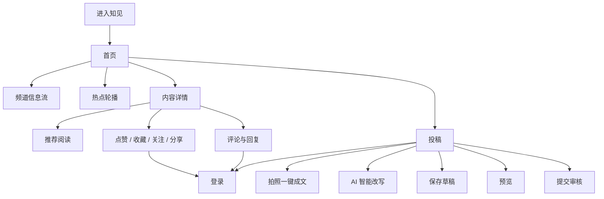
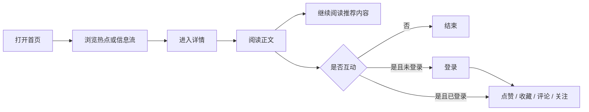
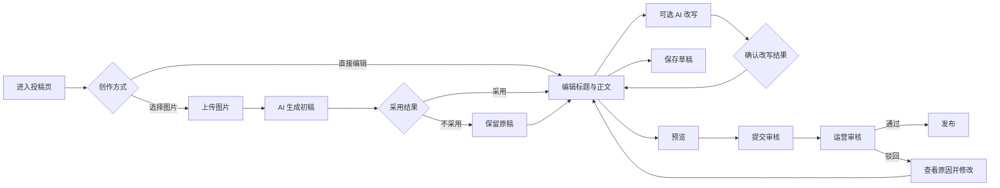

# 知见产品需求文档（PRD）

> 产品名称：知见  
> 版本：v1.0  
> 文档状态：一期评审稿  
> 适用端：微信小程序、H5  
> 关联文档：[视觉设计规范](./design.md) · [接口与数据模型](./接口与数据模型.md) · [前后端架构与时序图](./前后端架构与时序图.md)

## 1. 产品概述

### 1.1 产品定位

知见是一个以深度资讯、公共议题和观点交流为核心的内容信息平台。

产品通过克制、权威的内容呈现方式，帮助用户快速了解热点背景、阅读完整观点，并围绕内容进行有秩序的讨论。同时为投稿人提供拍照成文和 AI 改写能力，降低高质量内容创作门槛。

### 1.2 产品价值

对阅读者：

- 从热点卡片快速进入值得关注的议题。
- 通过结构清晰的长文获得背景、事实和观点。
- 在评论区查看不同立场并参与讨论。

对投稿人：

- 从图片或现场素材快速生成可编辑初稿。
- 在不改变事实的前提下优化标题、结构和表达。
- 保存草稿、预览内容并跟踪审核结果。

对运营人员：

- 无需一期运营后台，也可通过受控脚本完成内容发布。
- 可配置频道、热点轮播、推荐内容和内容标签。
- 投稿必须经过审核，避免用户内容直接进入正式信息流。

### 1.3 产品原则

- 内容优先：界面服务于阅读，不用装饰干扰正文。
- 事实优先：AI 只辅助表达，不替代事实核验。
- 用户确认：AI 结果不得自动覆盖原稿或自动提交。
- 审核发布：用户投稿不得绕过审核直接发布。
- 克制互动：强调有内容的讨论，不以强刺激机制驱动互动。
- 跨端一致：小程序和 H5 保持一致的信息结构和核心体验。

## 2. 背景与问题

当前产品已经完成首页、内容详情页和投稿页的前端 Demo，但仍使用本地静态数据，AI 能力也为模拟流程。

一期需要解决：

1. 内容如何从数据库稳定地进入首页和详情页。
2. 用户如何登录并完成点赞、收藏、关注、评论和回复。
3. 投稿人如何上传图片、使用 AI、保存草稿并提交审核。
4. 没有运营后台时，运营如何安全地发布内容和配置轮播。
5. H5 与微信小程序如何共用业务规则、数据结构和视觉规范。

## 3. 产品目标

### 3.1 一期目标

- 完成“内容发布 → 首页分发 → 详情阅读”的只读闭环。
- 完成“登录 → 点赞/收藏/评论”的用户互动闭环。
- 完成“上传素材 → AI 辅助 → 保存草稿 → 提交审核 → 发布”的投稿闭环。
- 支持 H5 与微信小程序正式环境部署。
- 建立关键行为埋点，为后续内容和转化优化提供依据。

### 3.2 建议核心指标

内容消费：

- 首页内容点击率。
- 详情页有效阅读率。
- 文章阅读完成率。
- 推荐阅读点击率。

用户互动：

- 详情页互动率。
- 评论发布成功率。
- 收藏率与关注转化率。

投稿与 AI：

- 投稿开始到提交的转化率。
- 草稿保存成功率。
- AI 任务成功率和平均耗时。
- AI 结果采用率。
- 投稿审核通过率。

稳定性：

- 首页和详情接口可用性。
- 页面首屏加载时间。
- 上传成功率。
- 客户端错误率。

一期上线前不强行设定缺乏历史依据的数值目标。建议先采集 2–4 周基线，再确定增长目标。

### 3.3 一期非目标

- 不建设完整 Web 运营管理后台。
- 不实现复杂个性化推荐算法。
- 不实现私信、群聊和完整消息中心。
- 不实现积分、等级、排行榜或付费体系。
- 不开放用户投稿直接发布。
- 不在客户端存放数据库、对象存储或 AI 服务密钥。
- 不拆分微服务，后端优先采用模块化单体。

## 4. 用户角色

### 4.1 访客

- 浏览首页、频道、热点和文章详情。
- 查看推荐阅读及公开评论。
- 尝试互动时进入登录流程。

### 4.2 登录用户

- 拥有访客全部能力。
- 点赞、收藏和关注作者。
- 发表评论、回复及点赞评论。
- 进入投稿流程。

### 4.3 投稿人

- 上传封面和现场图片。
- 使用拍照成文与 AI 改写。
- 编辑、预览和保存草稿。
- 提交审核并查看审核结果。

一期默认所有正常状态的登录用户都可投稿；如后续存在合规要求，再增加投稿资格申请。

### 4.4 运营人员

- 通过可信 CLI 或受控 SQL 导入内容。
- 审核投稿并填写驳回原因。
- 发布审核通过的投稿。
- 配置首页轮播、频道、标签和推荐阅读。

## 5. 信息架构



一期核心页面：

- 首页。
- 内容详情页。
- 投稿页。
- 登录承接页或登录弹层。
- 草稿/投稿状态承接能力。

底部导航中的“专题、消息、我的”一期可保留入口，但未实现时不得进入空白页。应显示清晰的“功能建设中”状态，或在正式版本中暂时隐藏。

## 6. 核心用户流程

### 6.1 阅读流程



### 6.2 投稿流程



## 7. 功能范围与优先级

### 7.1 P0：一期必须上线

- 首页频道、热点轮播和三类信息流。
- 内容详情、推荐阅读和评论列表。
- 登录后点赞、收藏、关注、评论、回复及评论点赞。
- 图片上传、拍照成文和 AI 改写。
- 投稿编辑、预览、草稿保存和提交审核。
- 投稿审核状态与受控发布流程。
- 内容导入 CLI 或标准 SQL 事务。
- H5 与微信小程序构建、部署和基础监控。

### 7.2 P1：一期后增强

- 搜索。
- 专题聚合页。
- 我的收藏、关注和投稿记录。
- 消息通知。
- 文章朗读与字号设置。
- AI 任务主动推送，替代前端轮询。
- 运营缓存刷新工具和更完善的审核工作台。

### 7.3 P2：后续规划

- 个性化推荐。
- 作者主页和创作者认证。
- 多媒体内容形态。
- 数据分析后台。
- 完整内容审核与风控平台。

## 8. 详细产品需求

### 8.1 首页

#### 8.1.1 页面目标

帮助用户在最短时间内识别当前重点内容，并通过多样的信息流形态进入深度阅读。

#### 8.1.2 顶部品牌区

- 展示“知见”品牌名称。
- 提供搜索入口；搜索未上线前应显示“功能建设中”，不得进入无内容页面。
- 提供个人中心入口；“我的”未上线时使用同样的降级策略。
- 适配小程序状态栏和 H5 安全区。

#### 8.1.3 频道导航

- 默认选中“推荐”。
- 一期预置：推荐、热点、思想、民生、制度。
- 频道支持横向滚动。
- 点击频道后加载对应信息流，并重置分页游标。
- 切换失败时保留原频道内容并给出重试提示。

#### 8.1.4 热点轮播

- 位于频道导航下方。
- 支持 1–5 条有效资源，超过 5 条时服务端只返回前 5 条。
- 表达形式为图片、热点标识和主标题。
- 显示两位数计数器，例如 `01 / 05`。
- 每 5 秒自动切换。
- 支持用户左右手动滑动。
- 用户触摸时暂停自动切换，交互结束后恢复。
- 点击卡片进入对应内容详情。
- 只有 1 条资源时不自动轮播。
- 无有效热点时整个模块隐藏，不保留空白占位。

#### 8.1.5 最新内容信息流

支持三种展示形态：

1. 纯文字：标题、摘要、作者、时间和阅读量。
2. 左文右图：标题、摘要、频道、时间和右侧缩略图。
3. 上图下文：大图、标题、摘要、作者、时间和点赞数。

业务规则：

- 展示形态由服务端 `display_variant` 决定。
- 需要图片的形态若图片不可用，应降级为纯文字，不显示破图。
- 首屏默认加载 20 条，后续使用游标分页。
- 支持下拉刷新。
- 列表触底后加载更多，避免重复请求。
- 已无更多内容时显示轻量结束提示。

#### 8.1.6 首页状态

加载中：

- 首次加载使用结构占位，不显示空白页面。
- 频道切换只替换信息流区域，不阻塞顶部导航。

空状态：

- 当前频道暂无内容时显示说明和刷新操作。
- 热点为空时仅隐藏热点模块。

异常状态：

- 网络错误显示重试。
- 接口返回部分数据时优先展示可用区域。
- 下拉刷新失败时保留旧内容。

#### 8.1.7 首页验收

- 首次进入默认展示推荐频道。
- 热点数量不超过 5 条，5 秒自动切换且可手动滑动。
- 计数器与当前卡片一致。
- 三种信息流形态均能正确展示。
- 点击热点或信息流可打开正确内容。
- 下拉刷新和游标加载不会产生重复内容。

### 8.2 内容详情页

#### 8.2.1 页面目标

提供适合长时间阅读的正文体验，并在不打断阅读的前提下承接推荐与互动。

#### 8.2.2 文章头部

- 展示主标题。
- 有副标题时展示副标题；为空时不占位。
- 展示作者头像、作者名称和发布时间。
- 登录用户可关注或取消关注作者。
- 显示返回、更多操作入口。
- 朗读功能作为 P1；未接入时正式环境不展示无效按钮。

#### 8.2.3 正文

- 支持段落、图片、引用、小标题和列表等结构化内容块。
- 阅读正文使用阅读字体，操作与元信息使用界面字体。
- 图片按容器宽度自适应，保留合理宽高比。
- 图片加载失败显示语义化占位和替代文字。
- 正文末尾可展示编辑部提问或讨论引导。
- 展示内容标签。

#### 8.2.4 数据与互动

- 展示阅读量和点赞量。
- 登录用户可以点赞或取消点赞。
- 底部操作栏提供评论定位、收藏和分享。
- 未登录用户发起写操作时进入登录流程，登录成功后返回原页面。
- 点赞、收藏和关注使用乐观更新；服务端失败时回滚并提示。

#### 8.2.5 推荐阅读

- 正文结束后展示最多 3 条推荐内容。
- 推荐内容不得指向当前文章。
- 点击后进入新文章详情并滚动到页面顶部。
- 无推荐内容时隐藏整个模块。

#### 8.2.6 评论

- 默认按产品策略排序；一期建议按时间正序展示楼层。
- 每条评论展示头像、名称、地区、楼层、时间、正文和点赞数。
- 支持对评论回复。
- 有回复时展示回复摘要；更多回复通过独立接口加载。
- 支持评论点赞和取消点赞。
- 评论列表使用游标分页。
- 评论提交成功后立即显示，并以服务端返回数据为准。

评论约束：

- 空内容不可提交。
- 去除首尾空格后计算有效长度。
- 建议正文上限 500 字。
- 连续重复提交、敏感内容或频率超限时返回明确错误。
- 被删除或审核中的评论不得继续参与公开计数。

#### 8.2.7 详情页状态

- 内容不存在、已下线或无权限时展示独立结果页。
- 正文加载失败与评论加载失败分别处理。
- 用户互动失败不影响正文阅读。
- 分享失败时提供复制链接降级方案。

#### 8.2.8 详情页验收

- 标题、副标题、作者、时间、正文、标签和统计显示正确。
- 推荐内容不包含当前内容。
- 登录与未登录互动路径符合预期。
- 点赞和收藏重复操作保持幂等。
- 评论、回复和评论点赞成功后状态一致。
- 内容下线后不能通过旧链接继续读取正文。

### 8.3 投稿页

#### 8.3.1 页面目标

让用户可以直接创作，也可以从照片和已有文字开始，在 AI 辅助下完成可审核的内容草稿。

#### 8.3.2 编辑字段

封面：

- 建议比例 16:9。
- 支持 PNG 和 JPEG。
- 单张图片不超过 10 MB。
- 上传前校验格式和大小。
- 上传失败可重试，不清空其他字段。

主标题：

- 必填。
- 最多 30 个字符。
- 实时显示字数。

副标题：

- 选填。
- 最多 50 个字符。
- 为空时详情页不显示。

正文：

- 必填。
- 最多 5000 个字符。
- 一期支持段落、粗体、引用、列表、图片和链接。
- 富文本以结构化 `body_blocks` 保存，不直接信任客户端 HTML。

其他字段：

- 作者默认为当前登录用户。
- 栏目必选。
- 标签可多选；数量上限由服务端配置，一期建议最多 5 个。
- 原创声明默认为开启，用户可主动关闭。

#### 8.3.3 图片上传

- 客户端先获取上传凭证，再直传对象存储。
- 上传完成后必须调用确认接口。
- 只有状态为 `READY` 的媒体才能用于投稿和 AI 任务。
- 离开页面前仍在上传时，应提示用户等待或确认退出。

#### 8.3.4 拍照一键成文

用户操作：

1. 点击“拍照一键成文”。
2. 拍照或从相册选择图片。
3. 图片上传完成后创建 AI 任务。
4. 页面显示识别和生成进度。
5. 任务完成后展示标题、副标题、正文和建议标签。
6. 用户选择采用或放弃。

业务规则：

- AI 结果不得直接覆盖当前编辑内容。
- 当前已有内容时，采用前必须提示影响范围。
- 用户放弃 AI 结果后保留原稿和图片。
- 任务失败时提供重试，不重复上传已成功的图片。
- 页面退出后任务可继续执行，再次进入草稿时恢复任务状态。
- AI 生成内容必须显示“请核实事实”的提示。

#### 8.3.5 AI 智能改写

支持对象：

- 主标题。
- 副标题。
- 正文。
- 全文。

支持模式：

- 润色。
- 压缩。
- 扩写。
- 调整结构。

业务规则：

- 正文为空时不能发起正文改写。
- 发起任务时保存输入版本，避免任务完成后覆盖用户的新修改。
- 返回结果与当前版本不一致时，使用对比确认，不直接替换。
- 用户可以采用、复制或放弃结果。
- 采用结果后仍可撤销一次。
- AI 必须尽量保持原始事实，不新增无法验证的人名、数字或结论。

#### 8.3.6 草稿

- 首次保存调用创建草稿接口，后续保存调用更新接口。
- 支持用户主动保存。
- 建议在停止输入后自动保存，但自动保存不得打断编辑。
- 页面展示最近保存时间。
- 保存失败时保留本地编辑内容并允许重试。
- 多端同时编辑时以服务端版本号或 `updated_at` 检测冲突，不能静默覆盖。

#### 8.3.7 预览

- 预览应尽量接近真实详情页。
- 预览内容来自当前未提交编辑状态。
- 预览不生成正式内容 ID，不可被外部访问。
- 返回编辑页后保留滚动位置和全部字段。

#### 8.3.8 提交审核

提交前校验：

- 主标题和正文已填写。
- 栏目已选择。
- 所有关联图片状态为 `READY`。
- 字段长度和内容块格式符合要求。
- 用户确认原创声明状态。

提交规则：

- 提交前展示确认弹窗。
- 提交成功后状态变为 `SUBMITTED`。
- 已提交版本默认不可编辑；需要修改时执行撤回或被驳回后重新编辑。
- 一期若不支持主动撤回，应在提交确认中明确说明。
- 投稿只有审核通过并执行发布后，才能生成正式内容。

#### 8.3.9 审核状态

- `DRAFT`：草稿，可编辑。
- `SUBMITTED`：已提交，等待审核。
- `APPROVED`：审核通过，等待发布。
- `PUBLISHED`：已发布，可进入正式详情。
- `REJECTED`：已驳回，展示原因并允许修改后再次提交。

#### 8.3.10 投稿页验收

- 字段长度、必填项和上传限制正确生效。
- 图片不会经过业务 API 中转。
- AI 任务可正确展示等待、成功、失败和超时状态。
- AI 结果只有用户确认后才进入编辑器。
- 草稿保存失败不会导致内容丢失。
- 投稿提交后不会直接出现在首页。
- 审核通过并发布后可通过正式内容 ID 访问。

### 8.4 登录与会话

#### 8.4.1 微信小程序

- 使用微信登录 code 换取业务访问令牌。
- 微信身份通过 `user_identities` 与业务用户关联。
- 微信登录失败时允许重新发起，不进入死循环。

#### 8.4.2 H5

- 一期使用手机号验证码登录或微信 OAuth。
- 验证码发送需要频率限制和风控。
- H5 优先使用安全 Cookie 管理会话。

#### 8.4.3 登录承接

- 匿名用户可以浏览公开内容。
- 点赞、收藏、关注、评论和投稿必须登录。
- 登录成功后返回触发登录前的页面和操作上下文。
- Token 失效时先尝试刷新；刷新失败再要求重新登录。

### 8.5 运营内容与审核

#### 8.5.1 内容导入

一期使用受控 CLI：

```bash
zhijian-content import article.json
zhijian-content publish <content-id>
zhijian-content carousel set --position 1 --content-id <content-id>
```

导入要求：

- 导入数据必须经过结构校验。
- 正式内容必须有作者、频道、标题和正文。
- 图文形态必须有关联且可用的图片。
- 发布、标签关联和统计初始化在同一事务完成。
- 所有操作记录操作者、时间和结果。

#### 8.5.2 首页轮播

- 有效位置为 1–5。
- 同一位置同一时间只能有一条启用记录。
- 支持开始和结束时间。
- 轮播关联内容必须处于 `PUBLISHED`。
- 图片状态必须为 `READY`。

#### 8.5.3 投稿审核

- 审核人可以通过受控 SQL 或 CLI 查看待审核投稿。
- 审核通过和驳回都必须记录操作者与时间。
- 驳回必须填写用户可理解的原因。
- 发布过程必须生成正式内容记录，不能直接把投稿表当作线上正文表读取。

## 9. 通用交互规范

### 9.1 反馈

- 普通按钮点击后立即提供视觉反馈。
- 网络写操作进行中时防止重复提交。
- 成功使用轻量提示；需要用户决策时使用弹窗。
- 错误提示说明发生了什么以及用户下一步可以做什么。

### 9.2 加载

- 首屏使用骨架或结构占位。
- 列表加载更多使用局部加载状态。
- AI 等长任务显示明确阶段，不使用无限旋转且无说明的加载动画。
- 超过预期时间时提示用户可以离开页面，任务仍会继续。

### 9.3 空状态

- 空状态必须解释原因并提供可执行操作。
- 不使用纯空白页。
- 未完成的导航入口应隐藏或显示建设中说明。

### 9.4 无障碍

- 图片提供替代文字。
- 图标按钮提供可读名称。
- 关键文本与背景满足可读对比度。
- 交互目标满足移动端最小点击区域。
- 不能仅依赖颜色表达选中、失败或禁用状态。

## 10. 内容与合规要求

- 用户投稿和评论需要内容安全检测。
- AI 生成结果需要标记来源并保留任务审计信息。
- 用户必须确认 AI 生成内容中的事实、引用和图片权利。
- 原创声明不等于平台完成版权认证。
- 举报入口作为 P1，但上线用户内容前必须具备最低限度的投诉处理渠道。
- 已下线内容不得继续通过缓存或旧链接读取。
- 删除用户数据时需同步处理身份、互动和投稿数据，具体策略由隐私政策确定。

## 11. 数据埋点

### 11.1 首页

- `home_view`
- `channel_click`
- `carousel_impression`
- `carousel_swipe`
- `carousel_click`
- `feed_item_impression`
- `feed_item_click`
- `pull_refresh`

### 11.2 详情

- `content_view`
- `content_effective_read`
- `content_read_complete`
- `content_like`
- `content_favorite`
- `author_follow`
- `recommendation_click`
- `comment_submit`
- `comment_reply`
- `content_share`

### 11.3 投稿与 AI

- `submission_start`
- `media_upload_start`
- `media_upload_success`
- `ai_task_start`
- `ai_task_success`
- `ai_task_failed`
- `ai_result_apply`
- `ai_result_discard`
- `draft_save`
- `submission_preview`
- `submission_submit`
- `submission_published`

公共参数：

- `event_id`
- `occurred_at`
- `platform`
- `app_version`
- `session_id`
- `user_id`（登录后）
- `content_id` 或 `submission_id`（适用时）
- `request_id`（服务端交互适用时）

埋点不得上传正文、评论全文、手机号、Token 或 AI 原始敏感输入。

## 12. 非功能需求

### 12.1 性能

- 首页公共数据支持 30–60 秒缓存。
- 内容详情支持约 5 分钟公共缓存。
- 图片使用 CDN，并按展示尺寸生成合适规格。
- 首屏之外的图片懒加载。
- AI 接口采用异步任务，避免 HTTP 长连接等待。

建议上线验收目标：

- 正常网络下 H5 首页可交互时间不高于 3 秒。
- 首页和详情 API 的 P95 响应时间不高于 800 毫秒，不含第三方 AI。
- 点赞、收藏和评论写接口 P95 不高于 1 秒。
- AI 任务耗时由供应商能力决定，但必须提供超时和失败状态。

### 12.2 可用性

- 首页、详情和登录为核心可用链路。
- 单个推荐、评论或图片接口失败不应导致正文不可读。
- AI 服务不可用时，普通编辑和保存草稿仍可使用。
- Redis 不可用时可降级读取 PostgreSQL。

### 12.3 安全

- 全链路 HTTPS。
- 所有写请求进行鉴权、参数校验和限流。
- 对象存储上传凭证短时有效且最小权限。
- 数据库、对象存储和 AI Secret 不进入前端包。
- 日志对手机号、Token 和用户输入进行脱敏。
- 关键写操作使用事务和幂等约束。

### 12.4 兼容性

- 微信小程序以当前稳定基础库为准。
- H5 支持 iOS 12+、Android 7+ 及主流现代浏览器。
- 页面适配安全区、刘海屏和常见移动端宽度。

## 13. 依赖

外部依赖：

- 微信小程序登录和发布能力。
- H5 短信或微信 OAuth 服务。
- PostgreSQL。
- 对象存储和 CDN。
- AI 多模态及文本模型服务。
- 内容安全审核服务。
- Netlify 或等价 H5 托管环境。

内部依赖：

- 频道、作者、标签及首批正式内容。
- 投稿审核规则和运营责任人。
- 隐私政策、用户协议和内容规范。
- 正式域名、小程序 AppID 和服务端域名白名单。

## 14. 发布计划

### 阶段 A：只读内容闭环

- 建立后端基础工程和数据库迁移。
- 内容导入 CLI。
- 首页、详情、推荐和评论读取接口。
- 前端静态数据切换为 API。

完成标准：运营写入一篇内容后，可以在首页进入并完整阅读。

### 阶段 B：登录与互动

- 微信小程序和 H5 登录。
- 点赞、收藏、关注、评论与回复。
- 私有互动状态与公共缓存隔离。

完成标准：登录用户可以完成互动，重复请求不会产生重复数据。

### 阶段 C：投稿与 AI

- 对象存储直传。
- 草稿、预览和提交审核。
- 拍照成文、AI 改写和异步任务。
- 运营审核与发布。

完成标准：用户投稿经审核后成为正式内容，AI 失败不影响普通编辑。

### 阶段 D：上线加固

- 埋点、日志、监控和告警。
- 内容安全、限流和异常降级。
- 性能优化、兼容性测试和恢复演练。

完成标准：核心验收用例通过，并具备问题发现和回滚能力。

## 15. 上线验收清单

产品：

- 首页、详情和投稿主链路完整。
- 所有未实现入口都有明确处理，不出现空白页。
- AI 结果和审核状态对用户表达清晰。

设计：

- 颜色、字体、间距、圆角和组件符合 `design.md`。
- H5 与小程序核心布局一致。
- 加载、空、错和禁用状态完整。

研发：

- API 契约符合 `接口与数据模型.md`。
- 前端不包含任何服务端 Secret。
- 内容、投稿和互动写操作具备事务或幂等保护。
- H5 和小程序生产构建通过。

测试：

- 核心功能、异常流程、弱网、重复提交和登录过期通过。
- 图片上传失败、AI 超时和草稿冲突有可恢复路径。
- 已下线内容、被删除评论和无权限资源无法继续访问。

运营：

- 首批频道、作者、标签、内容和轮播已准备。
- 投稿审核和内容下线流程已演练。
- 有明确的内容投诉与紧急处置联系人。

## 16. 待确认事项

以下事项不影响前端 Demo，但在后端实施前需要确认：

1. H5 首选登录方式是手机号还是微信 OAuth。
2. 是否所有登录用户都可投稿，还是仅认证用户可投稿。
3. 评论默认排序采用时间、热度还是混合策略。
4. 投稿是否允许在 `SUBMITTED` 状态主动撤回。
5. 审核通过后自动发布还是由运营再次确认发布。
6. AI 模型供应商、单次成本上限、超时和内容保留周期。
7. 正文和评论的内容安全供应商及拦截策略。
8. 原创声明、隐私政策、用户协议和 AI 内容提示文案。
9. P1 搜索、专题、消息和“我的”页面的优先顺序。
10. 一期目标访问量、投稿量和可接受的运维成本。
