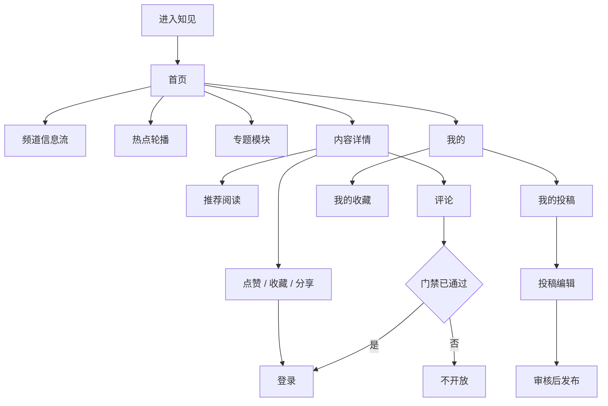

# 知见产品需求文档（PRD）

> 产品名称：知见  
> 版本：v1.2  
> 文档状态：按 2026-09-18 产品边界整理，替代 v1.0 中与本文冲突的条款  
> 适用端：微信小程序、H5  
> 关联文档：[产品边界](./docs/product-boundary.html) · [视觉设计规范](./design.md) · [接口与数据模型](./接口与数据模型.md) · [前后端架构与时序图](./前后端架构与时序图.md)

本文是当前产品契约。与 v1.0、补充版冲突时，以本文为准。本文不是法律意见。内容定位、评论策略、实名和托管在书面确认前，按第 2 章的执行边界开发，不能把开发完成当成上线批准。

## 1. 产品概述

### 1.1 产品定位

知见是一个以深度阅读为核心的内容产品。它帮助读者从热点进入一篇结构清楚的长文，看清背景、事实和观点。

讨论和投稿是后置能力。在内容定位没有书面结论之前，它们不进入对外上线范围。

### 1.2 产品原则

- 内容优先：界面服务于阅读，不用装饰打断正文。
- 事实优先：AI 只辅助表达，不替代事实核验。
- 用户确认：AI 结果不得自动覆盖原稿，不得自动提交。
- 审核发布：用户投稿不得绕过审核进入正式信息流。
- 克制互动：不做关注、积分、排行和强刺激机制。
- 不留假入口：未做的功能直接隐藏，不使用「建设中」占位。
- 演示与正式分开：演示页可以讲产品，不能当作正式账号、审核和合规已经完成。

## 2. 上线门禁

当前文章样本是两岸公共议题、制度与民生讨论，并带有评论。在书面定位结论出来之前，对外只上阅读。

对外上线指：小程序提审，或 H5 公网承接真实用户。演示和内测阅读不受此限制。

书面结论只有两条路，必须二选一，并同步给产品、运营和研发：

| 路线 | 含义 | 评论与投稿 |
|---|---|---|
| 保持公共议题 | 按法律意见办理相应资质、主体、编辑审核队伍和安全评估 | 资质完成前不开放 |
| 裁剪选题 | 只做已授权转载，以及法务确认可开展的非受限领域 | 评论是否可先发后审，由法务另行书面确认 |

签字前按更严的一侧执行：

- 真实评论默认先审后发。只有路线被书面裁成非新闻信息后，才允许改为先发后审。
- 内容安全检查与评论同一批上线，不能后补。
- 小程序里，微信登录得到的身份不算实名。评论若要上小程序，首次发言前使用法务认可的手机号授权。拒绝授权的人仍可阅读。
- 公网 H5 放在可备案的境内云上。海外静态托管只用于开发演示，不存放用户数据。
- AI 只用通过合规审查的境内模型。备案或供应商未就绪时，AI 入口隐藏，普通投稿编辑仍可进行。

评论或投稿对真实用户开放时，必须同时具备：用户协议、隐私政策、内容发布规范、评论规范、举报入口、投诉处理渠道、账号注销入口。演示里的「联系我们」不是这些渠道。

## 3. 范围

### 3.1 演示已经成立

这些交互以当前 Demo 为准，用来对齐阅读体验，不代表正式后端已接通。

- 首页：热点轮播、实时热点与专题按 6:4 并排、专题 6 块（三行两列）、最新内容。
- 详情：主副标题下展示阅读量；吸底条包含评论入口、点赞及计数、收藏、分享。
- 分享弹层：微信、朋友圈、微博。演示只复制链接。
- 登录：仅邮箱和密码。密码不保存。没有手机号登录，没有微信登录。
- 个人中心：账号、我的收藏、退出登录。收藏为一行一篇，左边主副标题，右边头图。
- 底栏：首页、联系我们、我的。联系我们只展示邮箱。
- 详情不展示关注、朗读和更多菜单。

### 3.2 正式一期要做

对外阅读上线：

- 以文章编号打开对应文章。热点、信息流、推荐、分享落地都使用同一套编号。
- 首页频道、热点轮播、三种信息流。
- 详情阅读、推荐阅读。
- 内容下线后，旧链接不可再读到正文。

登录与收藏上线：

- H5 使用手机号验证码。发送验证码前必须勾选协议。
- 小程序使用微信登录建立账号。评论若开放，另加手机号授权。
- 登录后可以点赞和收藏。未登录时这些状态是「没有状态」，不是「未点赞」。
- 我的收藏保持演示中的列表形式。

投稿上线（与评论同受第 2 章门禁约束）：

- 编辑、预览、草稿、提交审核。
- 我的投稿，展示审核状态。
- 审核通过后由运营发布，不自动进入首页。
- 审核走受保护的管理接口，并记录审核人。不用临时改数据库代替审核。

底栏在正式版只保留：首页、投稿、我的。

### 3.3 明确不做

- 搜索、消息中心、字号、朗读。
- 关注作者、作者主页、账号合并。
- 视频、深色模式、个性化推荐、积分、等级和付费。
- 完整运营后台。一期用脚本和管理接口。
- 微信网页授权的产品入口。
- 邮箱登录进入正式版。
- 任何只弹出「建设中」的导航入口。

## 4. 用户角色

### 4.1 访客

可以浏览首页、频道、热点和详情，查看已公开的评论，使用分享。

不可以点赞、收藏、评论、投稿或使用 AI。

### 4.2 登录用户

拥有访客能力。可以点赞和收藏。评论、回复、评论点赞和投稿只在第 2 章门禁通过后开放。

正式版新用户没有可用的微信昵称或头像时，昵称默认为「知见读者」加 4 位数字，头像为首字色块。演示版可以用邮箱前缀展示，该规则不进入正式版。

### 4.3 投稿人

一期所有正常登录用户都可以投稿。投稿资格不另设申请。

可以上传封面和正文图片，编辑、预览、保存草稿、提交审核，并在「我的投稿」查看结果。AI 只有开关打开且用户确认后，才写入正文。

### 4.4 运营

没有网页后台。通过管理接口或受控脚本导入内容、审核投稿、发布、下线，并配置轮播、频道和标签。审核和发布必须留痕。

## 5. 信息架构

正式一期页面：

- 首页。
- 内容详情。
- 登录。
- 我的，以及我的收藏。
- 门禁通过后：投稿、我的投稿、评论。

专题可以出现在首页模块里。专题聚合不是底栏，也不是一期必做页面。

## 6. 阅读

### 6.1 首页

目标：尽快认出当前要读的内容，并进入详情。

顶部只展示「知见」。不放搜索框。

频道：

- 默认「推荐」。
- 预置：推荐、热点、思想、民生、制度。
- 「推荐」只用于分发，不能作为投稿栏目。
- 切换频道时重置分页。失败时保留当前列表并允许重试。

热点轮播：

- 放在频道下方，1 到 5 条。超过 5 条时只返回前 5 条。
- 每条包含图片、热点标识和标题，以及 `01 / 05` 这样的计数。
- 多于 1 条时每 5 秒切换，可手动滑动。手指按下时暂停，松开后恢复。
- 点击进入该条内容的详情。
- 没有有效热点时隐藏整个模块。

实时热点与专题可以按演示中的 6:4 并排展示。专题固定 6 块，三行两列。这个模块不是底栏里的专题频道。

最新内容有三种形态，由服务端 `display_variant` 决定：

1. 纯文字：标题、摘要、作者、时间、阅读量。
2. 左文右图：标题、摘要、频道、时间、右侧头图。
3. 上图下文：大图、标题、摘要、作者、时间、点赞数。

图片不可用时降级为纯文字，不显示破图。首屏 20 条，之后用游标分页。支持下拉刷新。没有更多内容时给出结束提示，不重复请求。

首页首次加载用结构占位。频道切换只替换信息流。网络失败时保留已有内容并提供重试。

验收：默认进入推荐；热点不超过 5 条且计数正确；三种形态都能展示；点击打开的是该条内容，不是固定的一篇；刷新和翻页不重复。

### 6.2 详情

目标：长时间阅读不被打断。推荐和互动放在正文之后或吸底，不插在段落中间。

头部：

- 返回，以及居中的「知见」。没有朗读，没有更多菜单。
- 主标题。有副标题才显示，没有则不占位。
- 阅读量紧挨在主副标题下面，使用次要文字，不单独做指标卡片。
- 作者头像、名称、发布时间。没有关注。

正文只渲染四种块：段落、小标题、图片、引用。粗体、列表、链接和视频不进入一期。图片按容器宽度自适应，失败时显示替代文字。正文末尾展示标签。不在正文中硬编码插图位置。

推荐阅读最多 3 条，不得包含当前文章。没有推荐时隐藏模块。点击后打开对应文章并回到顶部。

吸底条从左到右：评论输入、评论计数、点赞及计数、收藏、分享。

- 点赞和收藏只在登录后生效。重复操作保持幂等，失败时回滚。
- 评论计数点击后滚到评论区。评论未开放时，输入框不提交。
- 分享在演示中复制链接，并提示去微信、朋友圈或微博。正式小程序使用微信分享。H5 不承诺每篇文章一张分享图。

内容不存在、已下线或无权阅读时，展示独立结果页，不能靠缓存继续读到正文。评论或推荐失败不影响正文。

验收：阅读量在标题下；点赞在吸底条且计数正确；没有关注和朗读；打开的正文与链接中的文章编号一致；下线后旧链接不可读。

## 7. 登录、收藏与个人中心

### 7.1 演示登录

只接受邮箱和密码。密码不写入本地。已登录时个人中心显示邮箱前缀和邮箱，并可退出。

这只服务演示。正式版删除这条路径。

### 7.2 正式登录

H5：

1. 输入手机号。
2. 勾选用户协议和隐私政策。未勾选不能发验证码。
3. 获取验证码，按钮进入冷却。
4. 登录并回到触发登录前的页面。

不向用户暴露该手机号是否已经注册。验证码错误、过期和发送过频要分开提示。

小程序用微信登录建立业务账号。需要实名的写操作，在动作发生前再要手机号授权。

登录成功后自动继续：点赞、取消点赞、收藏、取消收藏、评论点赞。不自动提交评论或投稿。

会话失效时先刷新。刷新失败再要求重新登录。

### 7.3 我的

演示：账号信息、我的收藏、退出登录。

正式一期在同一页增加「我的投稿」。不增加关注、消息和投稿以外的菜单。

我的收藏：

- 一行一篇。
- 左边是主标题和副标题，各最多两行。
- 右边是文章头图。没有头图时不显示破图。
- 点击进入该文章编号的详情。
- 没有收藏时说明原因，并指向文章页的收藏动作。
- 取消收藏后，返回此页不再出现该篇。

未登录不能进入收藏列表和投稿列表，先去登录。

## 8. 评论

评论列表可以在阅读期展示运营已经公开的评论。用户写评论、回复和评论点赞，必须等第 2 章门禁通过。

默认策略是先审后发：

- 提交后用户看到「审核中」，不进入公开列表，不增加公开计数。
- 通过后才公开。
- 命中风险或被举报成立后隐藏，并回滚计数。

若书面结论允许先发后审，状态改为提交后公开，异步命中后再隐藏。在该书面结论出现前，不按演示里的「提交后立刻出现」实现。

展示：

- 按时间正序排列楼层。
- 每条包含头像、名称、地区、楼层、时间、正文和点赞数。
- 回复最多先展示两条，其余按需加载。
- 用户可以删除自己的评论。删除后楼层号保留，正文不再公开。

限制：去掉首尾空格后不能为空，最长 500 字。重复提交、频率超限和未通过审核时，提示下一步，不暴露内部规则细节。

## 9. 投稿与 AI

### 9.1 何时可见

投稿页和「我的投稿」在门禁通过前不对正式用户开放。演示里的投稿页可以保留为交互样稿，不能提交到真实审核队列。

### 9.2 编辑

- 封面建议 16:9，PNG 或 JPEG，单张不超过 10 MB。
- 主标题必填，最多 30 字。副标题选填，最多 50 字。没有副标题时详情不占位。
- 正文必填，最多 5000 字。只保存段落、小标题、图片、引用。不信任客户端 HTML。
- 栏目必选，且必须是允许投稿的栏目。「推荐」不可选。
- 标签最多 5 个。
- 原创声明默认开启，用户可关闭。声明不等于平台完成版权认证。

图片先拿上传凭证再直传，完成后确认。只有状态为可用的图片能进入投稿和 AI。上传失败可重试，不清空其他字段。

### 9.3 AI

默认关闭。关闭时不展示拍照成文和改写入口。

打开后：

- 拍照成文和改写都是异步任务。失败可重试，不重复上传已成功的图片。
- 结果包括标题、副标题、正文或建议标签时，必须由用户选择采用或放弃。
- 已有正文时，采用前说明会影响哪些字段。
- 放弃后保留原稿。
- 采用后可撤销一次。
- 页面提示核实事实。生成内容带明确标识。
- 任务进行中离开页面，再次进入草稿可以恢复任务状态。

AI 不得新增无法核对的人名、数字或结论。输入不用于训练。

### 9.4 草稿、预览、提交

- 首次保存创建草稿，之后按版本更新。停止输入后可以自动保存，但不能打断编辑。
- 保存失败时留下本地内容并允许重试。版本冲突时不能静默覆盖。
- 预览接近详情页，不产生可被外部访问的正式文章编号。
- 提交前确认标题、正文、栏目、图片状态和原创声明。
- 提交后为已提交，默认不可编辑。驳回后可修改再交。一期不提供提交后主动撤回；确认文案里写明。
- 审核通过不等于发布。运营再次发布后，才生成正式文章。

状态：草稿、已提交、已通过、已发布、已驳回。驳回必须有用户能读懂的原因。

验收：投稿不会直接出现在首页；AI 未确认不会写入正文；AI 不可用时仍能保存草稿；发布后可以用正式文章编号打开。

## 10. 运营

导入、发布、下线和轮播配置都要校验结构，并记录操作者和时间。

- 正式文章必须有作者、频道、标题和正文。需要图片的形态必须有可用图片。
- 轮播位置 1 到 5，同一位置同一时间只有一条生效记录，关联文章必须已发布。
- 发布、标签和统计初始化在同一次操作里完成。
- 下线后立刻不可读。详情的公共缓存不超过 60 秒，并且下线命令要主动清掉缓存。
- 审核人、审核时间和原因写入审核记录。投稿表不是线上正文表。

## 11. 状态与异常

- 按钮点击后立即有反馈。写操作进行中不可重复提交。
- 首屏用结构占位。列表用局部加载。长任务说明阶段，并允许离开后继续。
- 空状态说明原因，并给出一个能做的动作。
- 错误说明发生了什么，以及用户下一步可以做什么。
- 图标按钮有可读名称。不能只靠颜色表示选中或失败。
- 未登录发起点赞或收藏时去登录，成功后回到原操作。评论和投稿不自动提交。

## 12. 埋点

只记录行为，不上传正文、评论全文、手机号、验证码、令牌或 AI 原文。

阅读：`home_view`、`channel_click`、`carousel_impression`、`carousel_click`、`feed_item_click`、`content_view`、`content_effective_read`、`content_read_complete`、`recommendation_click`。

互动：`content_like`、`content_favorite`、`content_share`。不做 `author_follow`。

评论和投稿只在对应能力开放后上报：`comment_submit`、`comment_reply`、`submission_start`、`draft_save`、`submission_submit`、`submission_published`、`ai_task_start`、`ai_task_success`、`ai_task_failed`、`ai_result_apply`、`ai_result_discard`。

公共参数：事件编号、时间、端、版本、会话。登录后可带用户编号。适用时带文章编号或投稿编号。

## 13. 非功能需求

- 首页公共数据缓存 30 到 60 秒。详情公共缓存不超过 60 秒，且不含点赞、收藏等个人状态。
- 正常网络下 H5 首页可交互时间不超过 3 秒。首页和详情接口 P95 不超过 800 毫秒，不含 AI。
- 点赞、收藏和评论写接口 P95 不超过 1 秒。
- 正文可读不依赖推荐、评论或单张图片成功。
- AI 不可用时，草稿和普通编辑仍可用。
- 全链路 HTTPS。写请求鉴权、校验、限流，并保证重复提交不重复计数。
- 数据库、对象存储和模型密钥不进入客户端。
- 日志脱敏手机号、令牌和用户输入。
- 正式 H5 使用境内已备案环境。演示托管不承接正式用户。
- 小程序以当前稳定基础库为准。H5 支持 iOS 12+、Android 7+ 和主流现代浏览器，并适配安全区。

## 14. 发布顺序

1. 阅读闭环。运营发布一篇文章后，首页能进入，详情按文章编号展示正确正文。
2. 正式登录、点赞、收藏、我的收藏。重复操作不重复计数。
3. 书面门禁通过后，再开评论、举报、投稿和审核发布。AI 单独开关，不阻塞第 3 步里的普通投稿。
4. 埋点、监控、限流和回滚。核心验收通过后才对外放量。

第 1 步不等待评论和 AI。第 3 步不等待 AI 备案，但等待第 2 章的书面结论。

## 15. 验收

产品：

- 阅读链路用文章编号打通，不依赖某篇写死的演示文。
- 正式底栏只有首页、投稿、我的。
- 未做的搜索、消息、关注、朗读没有入口。
- 门禁未通过时，正式环境不能提交评论和投稿。

设计：

- 颜色、字体、间距和组件符合 `design.md`。
- 阅读量在标题下，点赞在吸底条，收藏列表左文右图。
- 加载、空、错状态完整。

研发：

- 接口契约与 `接口与数据模型.md` 对齐；冲突时先改契约再改实现。
- 客户端不含服务端密钥。
- 下线后旧链接不可读。
- H5 与小程序生产构建通过。

运营：

- 首批频道、作者、标签、文章和轮播已准备。
- 审核、发布和下线演练过。
- 评论或投稿开放前，投诉联系人和协议文本已就位。

## 16. 仍须书面确认

下面四项未确认前，按第 2 章执行，不再作为研发可自行选择的产品问题：

1. 走资质路线，还是裁剪选题。
2. 在裁剪选题之后，评论是否改为先发后审。
3. 小程序评论采用哪一种法务认可的实名方式。
4. 正式 H5 的备案域名和境内托管位置。

AI 供应商、超时和保留周期在打开 AI 开关前确认。不影响阅读和普通投稿的排期。
