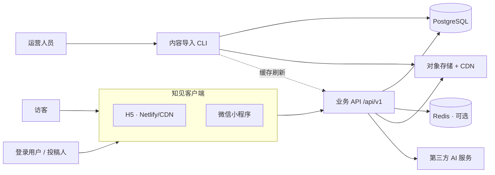
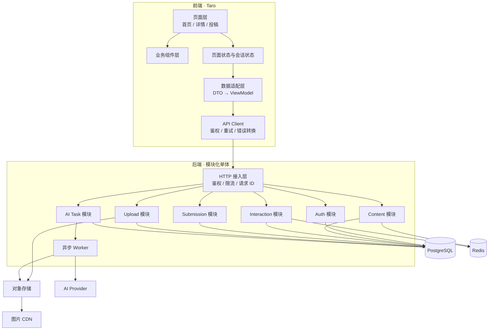
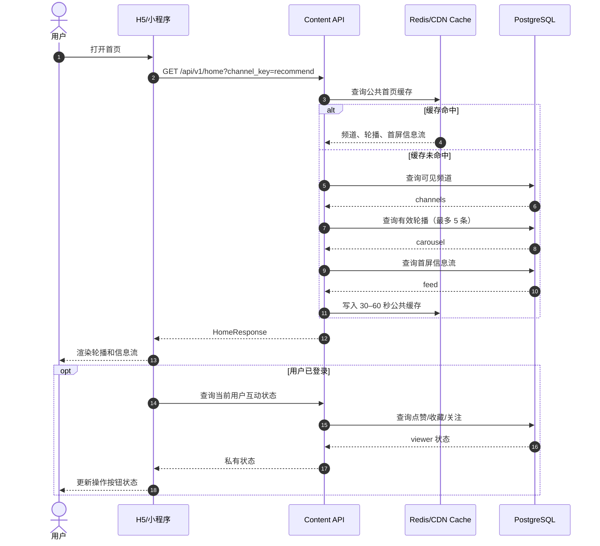
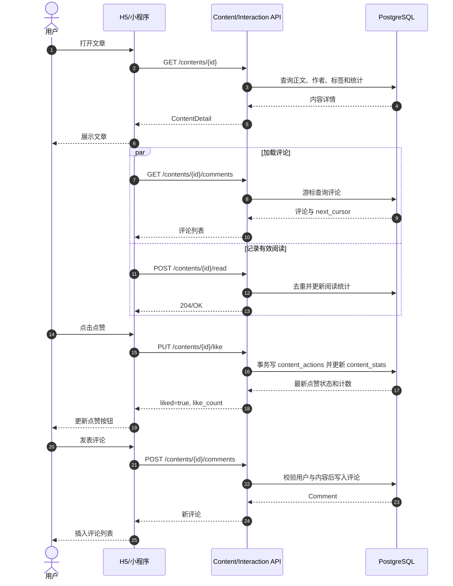
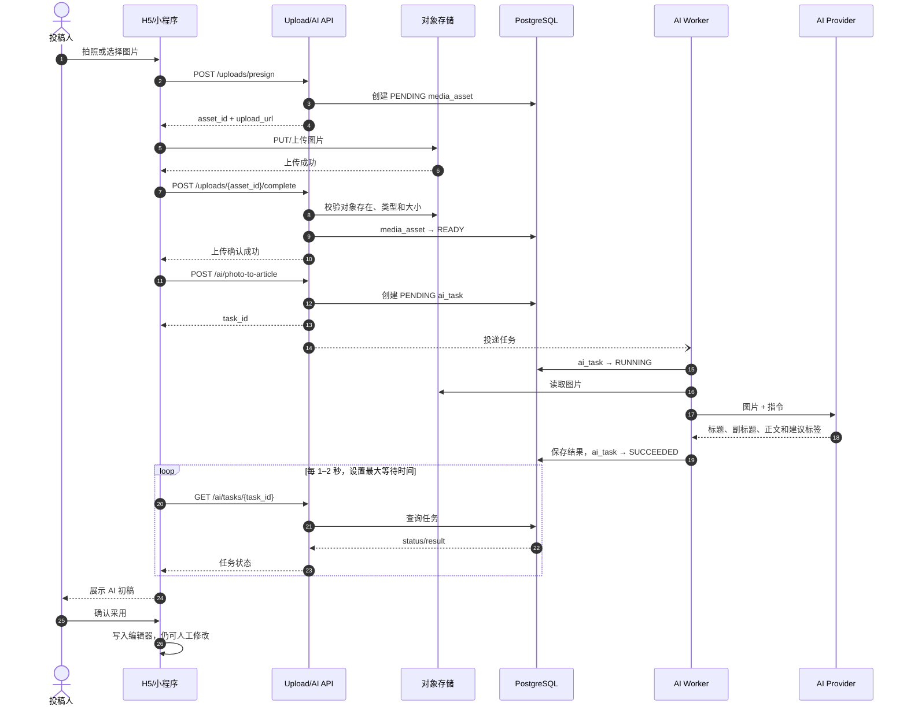
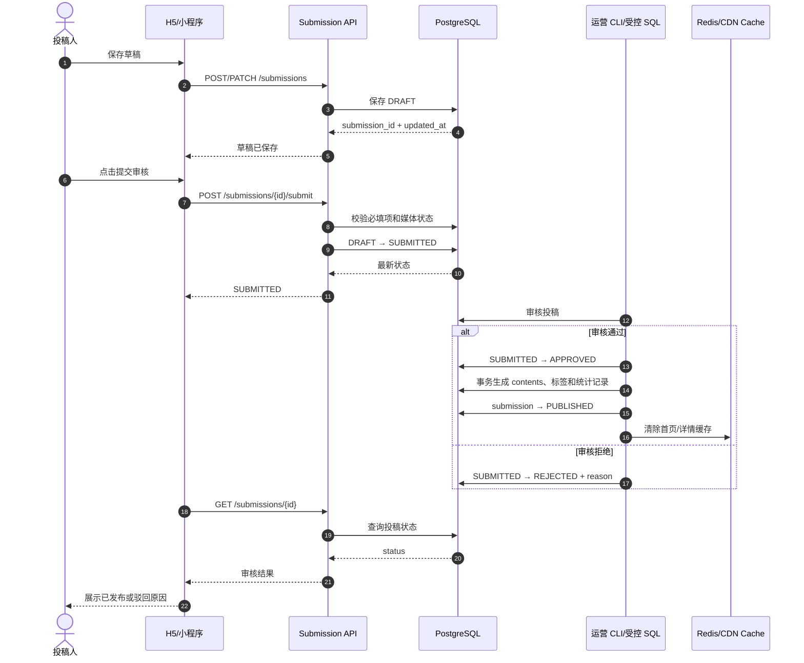
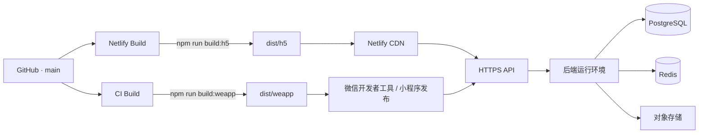

# 知见前后端架构与时序图

> 版本：v1.0  
> 适用端：微信小程序、H5  
> 关联文档：[接口与数据模型.md](./接口与数据模型.md)  
> 当前阶段：前端 Demo 已完成；后端、鉴权、对象存储和 AI 服务待接入。

## 1. 架构目标

- 一套 Taro 前端代码同时构建微信小程序和 H5。
- 客户端只访问业务 API，不直连 PostgreSQL。
- 图片由客户端直传对象存储，业务 API 只签发上传凭证并记录元数据。
- 首页、详情、评论、互动、投稿和 AI 任务按业务模块隔离。
- 一期不建设运营后台，可信内容通过受控 CLI 或 SQL 事务写库。
- AI 生成内容必须经用户确认；投稿必须审核后才能发布。
- 公共内容允许缓存，用户点赞、收藏等私有状态不得进入公共缓存。

## 2. 当前实现与目标形态

### 2.1 当前 Demo

- 前端：Taro 4、React 18、TypeScript、Sass。
- 数据：`src/data/content.ts` 中的本地静态数据。
- 图片：随前端包发布的 PNG 资源。
- AI：投稿页使用本地定时器模拟拍照成文和智能改写。
- H5：Netlify 构建并发布 `dist/h5`。
- 小程序：构建至 `dist/weapp`，由微信开发者工具上传。

### 2.2 一期目标

- 将静态内容层替换为 `/api/v1` REST API。
- 接入 PostgreSQL、对象存储和登录服务。
- AI 请求使用异步任务，前端轮询任务状态。
- 增加内容导入 CLI，承担运营内容和首页轮播配置。
- Redis、消息队列按流量和 AI 任务耗时逐步接入。

## 3. 系统上下文



关键边界：

- H5 和小程序共用页面、组件、类型及 API Client。
- 数据库凭证、对象存储密钥和 AI 密钥只存在于服务端或受控 CLI。
- CLI 仅使用权限受限的 `content_writer` 数据库角色。
- 投稿、评论、互动和用户数据必须经过业务 API 写入。

## 4. 容器与模块架构



一期建议采用“模块化单体”而不是立即拆微服务：

- 部署单元少，事务边界清晰。
- 内容、投稿和互动仍通过模块接口隔离。
- AI Worker 可最先独立扩容，其他模块在出现明确瓶颈后再拆分。

## 5. 前端架构

### 5.1 分层

1. 页面层：处理路由参数、页面生命周期和展示状态。
2. 组件层：封装热点轮播、信息流、评论、编辑器和底部导航。
3. 数据适配层：把 API DTO 转为前端稳定的 ViewModel。
4. API Client：统一 Base URL、Token、请求 ID、超时和错误码。
5. 会话层：管理访问令牌、刷新令牌及登录用户信息。

推荐目录：

```text
src/
├── api/
│   ├── client.ts
│   ├── auth.ts
│   ├── content.ts
│   ├── submission.ts
│   └── ai.ts
├── adapters/
├── components/
├── pages/
├── stores/
├── types/
└── assets/
```

### 5.2 数据迁移方式

第一步保留现有页面组件，只把：

```text
src/data/content.ts
```

替换为：

```text
页面 → API Client → 数据适配器 → 页面 ViewModel
```

页面不应直接依赖数据库字段名，避免后端字段调整扩散到所有组件。

### 5.3 跨端差异

- 登录：小程序使用 `wx.login` code；H5 使用短信或微信 OAuth。
- 上传：小程序使用 `Taro.uploadFile`；H5 使用 `fetch/PUT` 直传。
- 分享：小程序使用页面分享生命周期；H5 使用 Web Share 或复制链接。
- Token：小程序使用 Taro Storage；H5 优先使用安全 Cookie，无法使用时再采用受控存储方案。

## 6. 后端架构

### 6.1 接入层

统一处理：

- `/api/v1` 路由前缀。
- Bearer Token 校验与用户上下文注入。
- `X-Request-Id` 生成和透传。
- 参数校验、频率限制及统一错误响应。
- 结构化访问日志和敏感字段脱敏。

### 6.2 业务模块

Auth：

- 微信小程序登录、H5 登录、刷新令牌和退出。
- 维护 `users` 与 `user_identities`。

Content：

- 首页聚合、内容列表、详情、推荐和评论读取。
- 只返回 `PUBLISHED` 且在有效期内的正式内容。

Interaction：

- 点赞、收藏、关注、评论及回复。
- 依靠唯一约束保证重复请求幂等。
- 明细表是事实来源，`content_stats` 是展示用聚合数据。

Submission：

- 草稿创建、保存、提交审核和状态流转。
- 投稿状态：`DRAFT → SUBMITTED → APPROVED → PUBLISHED`，审核失败进入 `REJECTED`。

Upload：

- 校验文件类型、大小和用途。
- 签发短时上传凭证。
- 上传确认后将 `media_assets` 更新为 `READY`。

AI Task：

- 创建拍照成文或改写任务。
- 记录任务状态、输入摘要、结果和错误信息。
- Worker 调用 AI Provider；API 进程不阻塞等待长耗时结果。

### 6.3 数据与基础设施

- PostgreSQL：业务事实数据与事务。
- Redis：一期可选，用于首页缓存、限流和短期会话。
- 对象存储：原图、封面和正文图片。
- CDN：公共图片和 H5 静态资源分发。
- 消息队列：AI 任务量较小时可先用数据库任务表轮询，增长后再引入。

## 7. 核心时序图

### 7.1 首页加载



公共首页缓存不包含 `viewer` 字段，避免把一个用户的点赞或收藏状态返回给其他用户。

### 7.2 内容详情、点赞与评论



### 7.3 图片上传与 AI 拍照成文



AI 失败时任务进入 `FAILED`，返回可展示的错误码；前端保留用户原稿和已上传图片。

### 7.4 草稿提交、审核与发布



## 8. 部署架构



环境建议：

- `development`：本地前端、本地或共享测试 API。
- `staging`：独立数据库和对象存储桶，用于联调与验收。
- `production`：生产数据库、生产对象存储和正式域名。

前端只配置公开变量，例如 API Base URL；任何数据库、对象存储 Secret 和 AI Key 都不能进入前端构建环境。

## 9. 安全与可靠性

- 所有写接口要求登录；管理和运营能力使用独立权限。
- 上传凭证短时有效，并限制文件类型、大小、路径和用途。
- AI 输入、输出和失败原因落审计记录，但日志不得保存 Token 和隐私数据。
- 评论、AI、短信和登录接口增加用户/IP 维度限流。
- 点赞、收藏、关注通过唯一索引和事务实现幂等。
- 内容发布、轮播替换和投稿转正式内容必须使用事务。
- PostgreSQL 每日备份并定期执行恢复演练。
- 服务日志统一携带 `request_id`、`user_id`、模块、耗时和错误码。

## 10. 一期落地顺序

1. 建立后端工程、数据库迁移和统一响应格式。
2. 实现首页及详情只读 API，替换前端静态数据。
3. 接入微信/H5 登录、评论、点赞和收藏。
4. 接入对象存储直传和媒体状态确认。
5. 实现投稿草稿、审核状态及发布事务。
6. 实现 AI 异步任务和 Worker。
7. 增加内容导入 CLI、缓存、监控和告警。

一期验收标准：

- H5 和小程序使用同一套 API DTO 与前端适配层。
- 内容写库后能在首页和详情展示。
- 首页有效热点不超过 5 条。
- 登录用户可评论、点赞、收藏和投稿。
- AI 结果不会未经确认覆盖用户正文。
- 投稿不会绕过审核直接成为正式内容。
